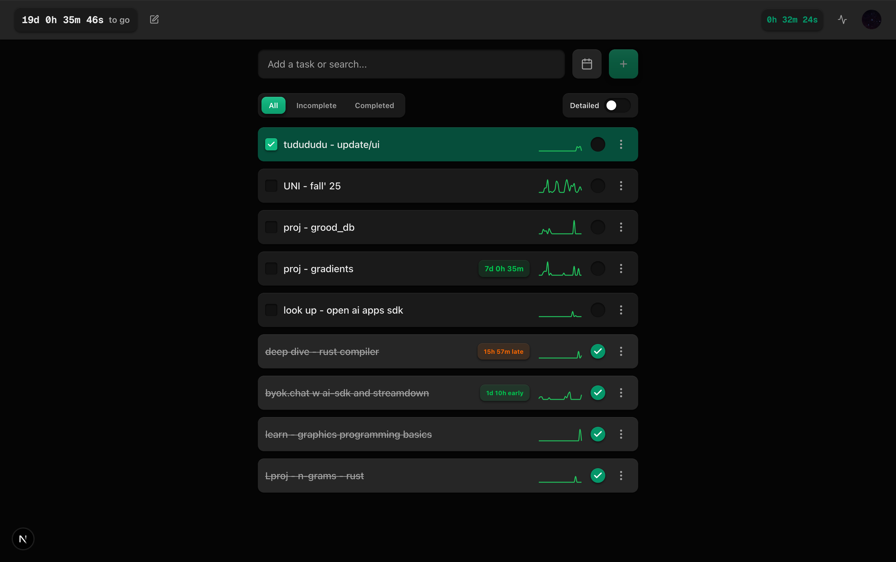
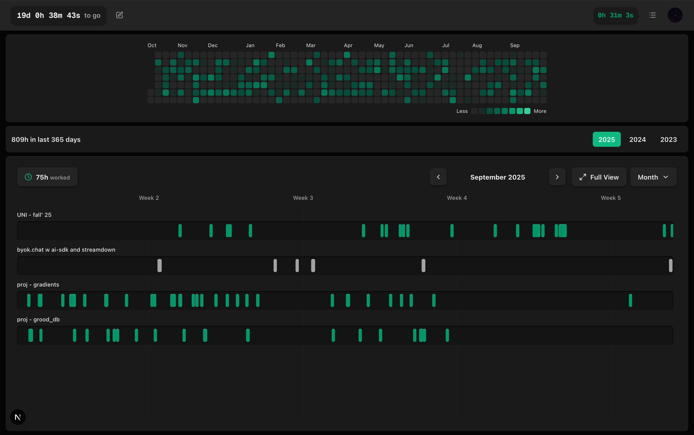

### Concept

It is really easy to sit on your desk all day long and feel like you are productive even though all you are doing is chaotic task swithing, hopping on things you find interesting at the moment, catching up with latest tech or reading random articles and actually getting nowhere. Deep work is really important which for me is sitting down for one single task at the moment and making real progress on it. I built tudududu to exactly to help me do that. It helps me be aware of how chaotic my timeline is, how much time I spent on things that actually matter and show my activity github style just cuz i find it so satifying.
